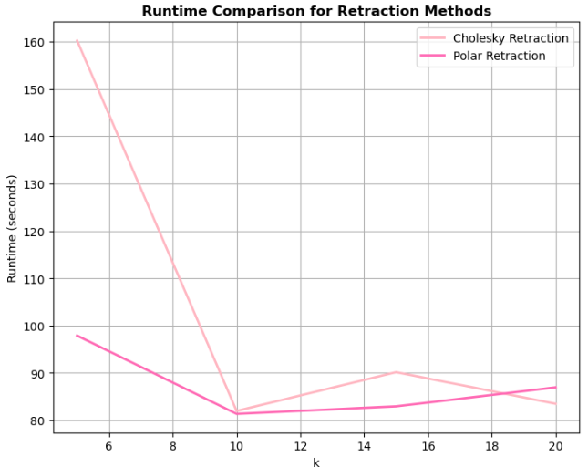

# **Multivariate Reduced-Rank Models**  
Welcome to the **Multivariate Reduced-Rank Models** repository:) This project presents **Canonical Correlation Analysis (CCA)** with numerical methods and optimization on matrix manifolds. It's a continuation of a prior project (2023) on Principal Component Analysis (PCA), expanding into CCA for high-dimensional data and data visualization.

---
## **🌟 Goals of the Project**  
1. **CCA for High-Dimensional Data**: Understand and apply CCA to explore relationships between datasets with many features.
2. **Optimization on Matrix Manifolds**: Use **Cholesky QR-based retraction** to improve the efficiency of manifold-based optimization methods. I use the Stiefel manifold for orthogonalization reasons.
3. **CCA for Cancer Cell Pathways Classification**: Apply CCA to determine which genes suppose a predisposition to be more or less sensitive to certain treatments.
   <p align="center">
</p>
  

The dataset contains gene expression data from breast cancer cell lines and corresponding KEGG pathway information. The data is derived from the GSE48213 dataset, which includes gene expression profiles of various breast cancer cell lines.
- Gene Expression Data:Genes (Ensembl IDs) x Cell lines (e.g., GSM1172844_184A1, GSM1172845_184B5, etc.)
- [KEGG Pathway Information](https://www.genome.jp/kegg/pathway.html): Genes (Ensembl IDs) x KEGG pathways

The list of drugs against breast cancer analyzed are currently:
1. HER2 Inhibitors:
    - Example: Lapatinib.
    - Importance:
        Crucial for HER2-positive breast cancer, which is an aggressive subtype but highly treatable with targeted therapies like HER2 inhibitors.
        HER2-positive cancers make up about 15-20% of breast cancer cases.
    - Potential ranking: Very important in the context of HER2-positive patients.

2. Hormone Therapy:
    - Examples: Tamoxifen, anastrozole, letrozole, exemestane.
    - Importance:
        Dominant for hormone receptor-positive (HR+) breast cancer, which constitutes about 70-80% of breast cancer cases.
        Hormone therapies are a cornerstone in treatment for postmenopausal and premenopausal HR+ cases.
    - Potential ranking: Likely the most important due to the high prevalence of HR+ breast cancer.

3. PARP Inhibitors:
    - Example: Olaparib.
   - Importance:
        Used primarily in patients with BRCA1/BRCA2 mutations, which are less common but significant for targeted treatment.
        Effective in treating triple-negative breast cancer (TNBC) with BRCA mutations, a challenging subtype to manage.
    - Potential ranking: Important but more niche compared to HER2 inhibitors and hormone therapy.

4. CDK4/6 Inhibitors:
    - Example: Palbociclib.
    - Importance:
        Used in HR+/HER2- advanced or metastatic breast cancer in combination with hormone therapy.
        Rapidly gaining prominence in first-line treatment for advanced HR+ cases.
    - Potential ranking: Very important, especially in advanced cases of HR+ breast cancer.

5. PI3K Inhibitors:
    - Example: Alpelisib.
    - Importance:
        Targets PIK3CA-mutated HR+/HER2- advanced breast cancer, a subset of hormone receptor-positive cancers.
        Approved for patients who progress on endocrine therapy.
    - Potential ranking: Important but more targeted for specific mutations.

---

## **🔧 Foundations**  
This project builds on the following key concepts:
- **Canonical Correlation Analysis (CCA)**: A method to identify and quantify relationships between two sets of high-dimensional variables.
- **Matrix Manifolds**: Focus on the **Stiefel manifold**, a space of orthonormal matrices.
- **Riemannian Optimization**: Optimization methods on curved spaces using retractions to maintain feasibility.
- **Cholesky Retraction**: A more efficient way of projecting points back onto a manifold compared to traditional methods like polar decomposition.

---

## **📚 Mathematical Background**  
This project revolves around the **generalized Stiefel manifold** \(\text{St}(n, p, B) = \{ X \in \mathbb{R}^{n \times p} : X^T B X = I_p\}\), where **\(B\)** is a positive definite matrix.  
### Key Equations:
- **CCA**: Maximizes the correlation between two sets of canonical variables:
  \[
  \text{max}_{A, B} \, \text{corr}(X A, Y B) \quad \text{such that} \quad A^T A = I, \, B^T B = I
  \]
- **Cholesky Retraction**: Retracts points from the tangent space to the manifold by:
  \[
  R_X(\xi) = X L^{-T}
  \]
  where **\(L\)** is the Cholesky factor obtained from \(Y = I + \xi^T B \xi\).

---

## **💻 Requirements**  
To run the code and experiments, make sure you have the following installed:
- **Python 3.11**
- **NumPy**: For numerical operations.
- **SciPy**: For matrix decompositions and linear algebra routines.
- **Matplotlib**: For plotting and visualization.
- **Pandas**: For handling datasets.
- **PyManopt**: For manifold optimization.

You can install the dependencies with:
```bash
pip install numpy scipy matplotlib pandas pymanopt

